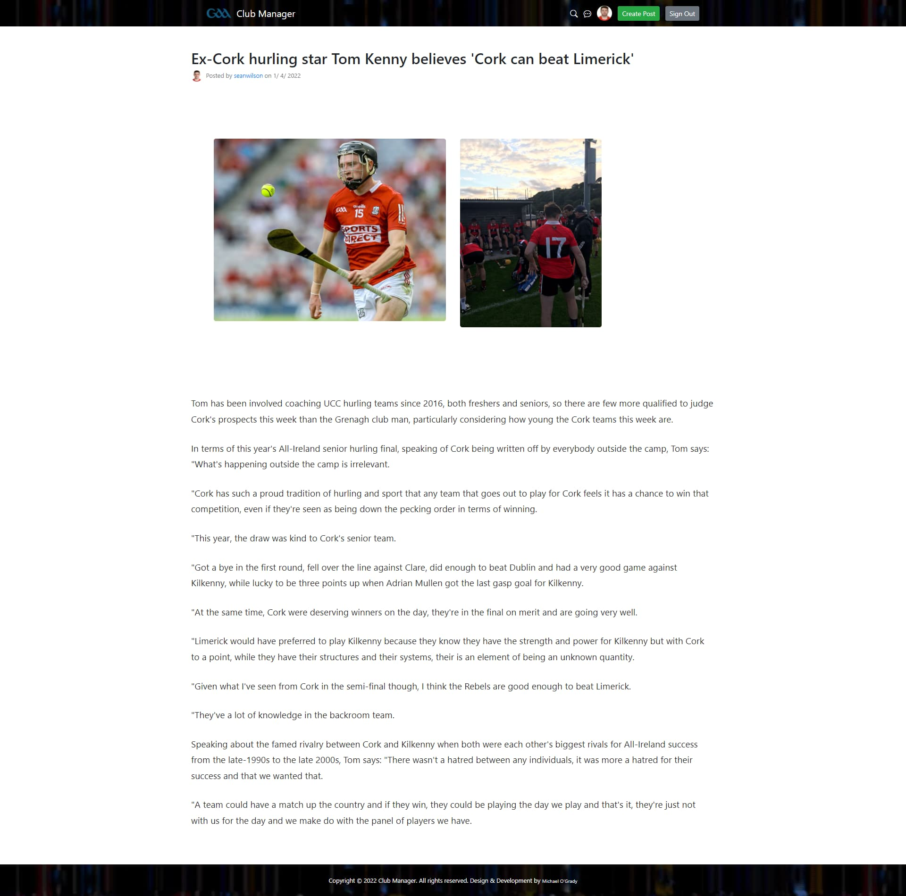

<h1 align="center">Club Manager</h1>

# Project Screenshots

<p align="center">




</p>

# Table of Contents

# Introduction

Club Manager is a Full-Stack JavaScript application developed in MVC Pattern on a Node backend using Express Server with Modular Class-Based JavaScript code. Club Manager represents a GAA Club Team Chat Application between players and managers which enables functionality such as:

- Live Socket Chat with Online Registered Members
- Posting of Club Information through a user profile based system in blog post format
- Follow other members functionality
- Custom user profile Avatar using [Gravatar](https://en.gravatar.com/)
- Search for Posts functionality
- Real-time serverside and clientside form validation
  - That username is already taken.
  - Username must be at least 3 characters.
  - You must provide a valid email address.
  - Password must be at least 12 characters.
- User input sanititazation on both client and server side inputs
- API Routing Developed for future Mobile App Integration
- Email Notification delivered to project owner for new post alert (
  SendGrid: Email Delivery, API, Marketing Service))
- Invalid username / password detection

Project uses the [EJS templating engine](https://ejs.co/) to render views, with data stored on a Cluster the [MongoDB Cloud](https://cloud.mongodb.com/) accessable through the Atlas interface. Simple frontend UI based on a modern off-the-shelf Bootstrap Template.

# Features — from a Developer Prospective

- Automatic App Restarts with Nodemon
- Modular Javascript code compiled with babel and webpack for JS Bundling
- Follow and Post Functionality based on user ID
- Protected Routes (UserController.mustBeLoggedIn)
- Flash messages for serverside form validation
- Object Validation with Prototype TypeOf
- Await/Async for database interaction
- Try catch block added to Await/Async
- Gravitar used for Avatars
- Array Destructuring used for Post,Followers,Following Counts
- Chat Functionality for logged in users
- Socket connection functionality between browser and server with socket.io@4.4.1
- Security addded to chat functionality with sanitizeHTML on the server and DOMPurify on the client side
- Real time Registration Form Validation to enhance user experience, real Validation is done on the server side.
- Checking if the username already exists within the MongoDB database prior to user registering -> using axios in the Registration to send async request to server
- Form submission prevented unless all elements are validated (preventing unnecessary round trips to server)
- onBlur event listened to within form submission -> ensure if user skips field errors still show
- CSRF attack protection
- API developed with seperate Router for API Requests
- JSON Webtokens using csurf protection middleware.
- MVC Pattern project schema
- Publicly available request
- CORS attack protection
- Send email functionality through SendGrid API
- Project hosted on Heroku
- .env secret credentials used
- express-session used for session cookies -> expiry = 7 days

# Live application

To view the live application visit the following URL:

- [https://club-manager-chat.herokuapp.com//](https://the-great-irish-bucket-list.herokuapp.com/)

# Project Schema

```
.
├── controllers
│   ├── followController.js
│   ├── postController.js
│   └── userController.js
├── frontend-js
│   ├── modules
│   |  ├── chat.js
│   |  ├── registrationForm.js
│   |  └── search.js
│   └── main.js
├── models
│   ├── Follow.js
│   ├── Post.js
│   └── User.js
├── public
│   ├── main-bundled.js
│   ├── styles.css
│   └── images
├── views
│   ├── includes
│   |  ├── flash.ejs
│   |  ├── footer.ejs
│   |  ├── header.ejs
│   |  └── profileShared.ejs
│   ├── 404.ejs
│   └── create-post.ejs
│   ├── edit-post.ejs
│   ├── home-dashboard.ejs
│   ├── home-guest.ejs
│   ├── profile-followers.ejs
│   ├── profile-following.ejs
│   ├── profile.ejs
│   └── single-post-screen.ejs
├── .env
├── app.js
├── db.js
├── router-api.js
├── router.js
├── package-lock.json
├── package.json
```

## NPM Packages used within Club Manager

- [x] @babel/core@7.17.7
- [x] @babel/preset-env@7.16.11
- [x] @sendgrid/mail@7.6.2
- [x] axios@0.24.0
- [x] babel-loader@8.2.3
- [x] bcryptjs@2.4.3
- [x] connect-flash@0.1.1
- [x] connect-mongo@4.6.0
- [x] cors@2.8.5
- [x] csurf@1.11.0
- [x] dompurify@2.3.6
- [x] dotenv@10.0.0
- [x] ejs@3.1.6
- [x] env@0.0.2
- [x] express-session@1.17.2
- [x] express@4.17.3
- [x] jsonwebtoken@8.5.1
- [x] marked@4.0.12
- [x] md5@2.3.0
- [x] mongodb@4.4.1
- [x] nodemon@2.0.15
- [x] sanitize-html@2.7.0
- [x] socket.io@4.4.1
- [x] validator@13.7.0
- [x] webpack-cli@4.9.2
- [x] webpack@5.70.0

# Instructions for running locally in development

To run the application for the first time on a windows PC, clone or download the repo and run the following commands:

- `npm install`
- `npm run watch`

Thereafter:
`npm run watch` starts two command prompt windows;

- webpack (Webpack is an open-source JavaScript module bundler.)
- nodemon (nodemon is a tool that helps develop node.js based applications by automatically restarting the node application when file changes in the directory are detected.)

Running the project on Linux/MAC requires you to ammend the start command (npm run watch command) in the `package.json` file

<p align="center">

</p>
